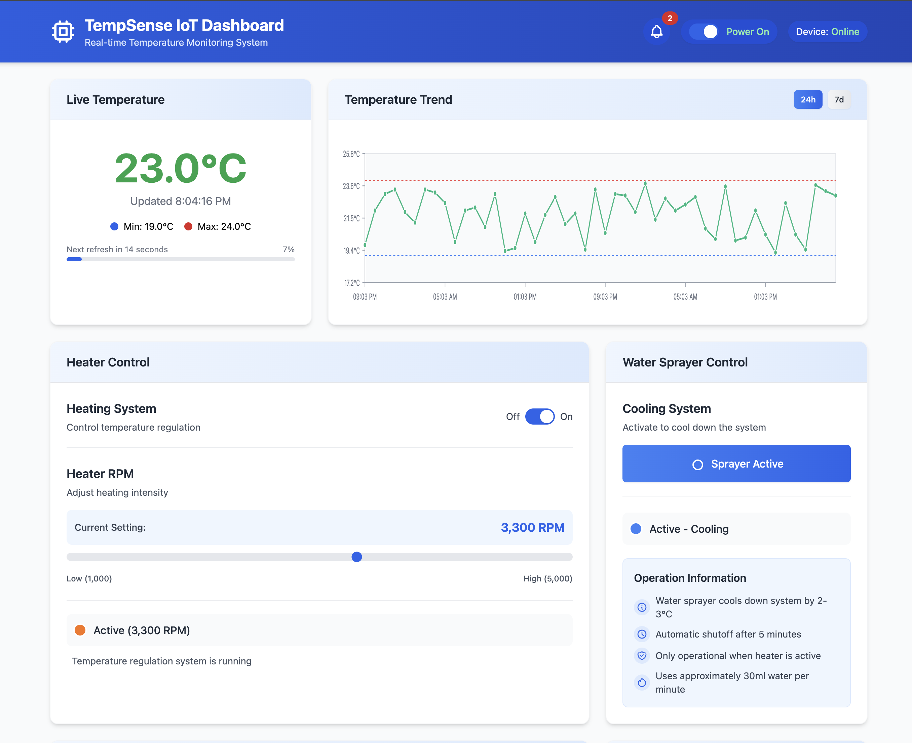
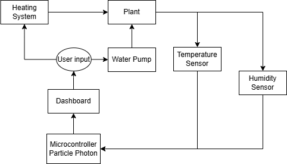

# IoT-Based Temperature Monitoring System

## Team Members
- Salmane El Mansour Billah
- Rania Terrab
- Ziyad Boudhim

## Project Description
This project implements an automated temperature monitoring system for industrial, agricultural, and healthcare environments. Using a TMP36 sensor connected to a Photon 20 microcontroller, the system collects real-time temperature data and transmits it to the cloud. A responsive web dashboard provides administrators with visualization tools, alerts, and remote control capabilities. The system features both remote monitoring via the web interface and local feedback through LED indicators and LCD display.

## Features
- Real-time temperature monitoring with configurable sampling rates
- Remote dashboard visualization with historical data trends
- Temperature threshold alerts with customizable parameters
- Device status updates (online/offline, battery level, connectivity)
- Manual controls (reset alerts, refresh data, toggle °C/°F)
- Comprehensive notifications log with alert history
- Power management with battery backup for continuous operation
- Automatic anomaly detection for temperature fluctuations
- Direct ThingSpeak API integration for cloud data storage and visualization
- Node-RED integration for advanced data processing and alerts

## Technologies Used
- Photon 20 Microcontroller
- TMP36 Temperature Sensor
- Particle Cloud / ThingSpeak for data transmission
- Node-RED for IoT workflow automation
- React.js and TypeScript for web dashboard
- Tailwind CSS for responsive UI design
- LED indicators and LCD display for local feedback
- LiPo battery for backup power supply

## Hardware Setup Instructions
1. Connect the TMP36 sensor to analog pin A0 on the Photon 20
2. Connect the status LEDs to pins D3 (warning) and D4 (critical)
3. Wire the LCD display to I2C pins (D0, D1)
4. Install the LiPo battery to the designated connector
5. Secure all components in the project enclosure
6. Power on the system via USB or external power supply

## Software Setup Instructions
1. Create an account on Particle Cloud or ThingSpeak
2. Flash the firmware to the Photon 20 using Particle Web IDE:
   - Upload the `Integration/code.c` file
   - Insert your authentication tokens
   - Deploy the firmware
3. Configure the web dashboard:
   - Clone the repository
   - Run `npm install` to install dependencies
   - Update API keys in `.env` file
   - Run `npm run build` to create production build
   - Deploy the dashboard to your hosting service
4. Set up ThingSpeak and Node-RED integration:
   - Follow the instructions in `Integration/ThingSpeak_Setup.md` to create your ThingSpeak channel
   - Install Node-RED using the guide in `Integration/NodeRED_ThingSpeak_Integration.md`
   - Import the Node-RED flow from `Integration/NodeRED_Flow.json`

## Integration Details
The project now includes a dedicated `Integration` folder with components for cloud connectivity:

- **code.c**: Embedded C code for the Particle Photon with direct ThingSpeak API integration using API key "UU67E4LHWZTK10H4"
- **NodeRED_ThingSpeak_Integration.md**: Comprehensive guide for setting up Node-RED to process data between Particle and ThingSpeak
- **NodeRED_Flow.json**: Ready-to-import flow for Node-RED that processes temperature alerts and sends them to ThingSpeak
- **ThingSpeak_Setup.md**: Step-by-step instructions for setting up ThingSpeak channels, visualizations, and alerts

The system now sends temperature, voltage, motor RPM, and alert status directly to ThingSpeak every 15 seconds, respecting the ThingSpeak free tier rate limits.

## ThingSpeak API Integration

The dashboard now integrates directly with ThingSpeak using the Read API Key "B9XCWXVC99VG7OL1" to display real-time temperature data. This integration provides several benefits:

1. **Real-time data display** - The dashboard fetches the latest temperature readings directly from ThingSpeak every 15 seconds
2. **Historical data access** - Up to 20 previous temperature readings are loaded when the dashboard initializes
3. **Reliable cloud storage** - All sensor data is securely stored in ThingSpeak's cloud platform
4. **Data persistence** - Temperature data remains available even when the local device is offline
5. **Integration with other services** - The same ThingSpeak channel can be used with IFTTT, MATLAB, or other services

The dashboard continues to provide a seamless user experience with progress indicators during data fetching and appropriate error handling with fallback to simulated data if ThingSpeak is temporarily unavailable.

## How to Use
1. Power on the system and confirm the green status LED illuminates
2. Access the web dashboard at your deployment URL
3. View current temperature in the "Live Temperature" panel
4. Review historical data in the "Temperature Chart" section
5. Set custom thresholds in the "Threshold Settings" panel
6. Monitor device status and connection health
7. Receive notifications when temperature exceeds thresholds
8. Toggle between Celsius and Fahrenheit as needed
9. Reset alerts or refresh data using the control panel
10. Access your ThingSpeak channel to view additional visualizations and analytics

## Screenshots

*Web dashboard showing temperature monitoring interface*

*Hardware implementation with Photon 20, TMP36 sensor, and indicator LEDs*

*Proposed IoT-based temperature monitoring system architecture.*

## License
This project is available for academic use only. All rights reserved © 2025 Salmane El Mansour Billah, Rania Terrab, Ziyad Boudhim.

## Acknowledgements
We would like to thank our course instructor Dr Ahmad Fiaz for guidance throughout this project. Special thanks to Particle.io for their robust IoT platform and documentation, and to ThingSpeak for their IoT analytics platform. This project was inspired by real-world applications of IoT technology in critical temperature monitoring environments.